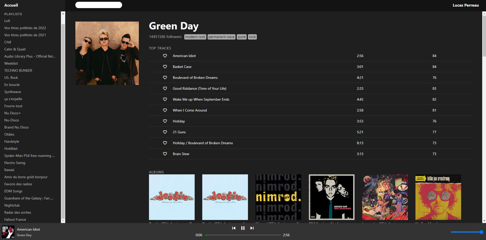

# Yew Spotify
Spotify player with Yew implementation (using JS Spotify Web Playback SDK)



You can do the following things:
- Play/Pause
- Change volume
- View a playlist
- View an album
- View an artist
- List your own playlists

List of things that are not implemented (yet):
- No search function
- No previous or next button
- No usage of the queue

## Installation guide

```shell script
# Build the yew application (for now it looks painful and redundant)
wasm-pack build --target web --out-name wasm --out-dir ./static

# Launch the /static as a server, you can use miniserve for example
cargo +nightly install miniserve
miniserve ./static --index index.html
```

## Dev note
So actually, I managed to create a Frankenstein of Rust and Javascript using the Spotify Web Playback SDK.

For now, the source code is a mess (but it works), and I'll do the following things:
- Transfer the token management to Rust in wasm, if not possible then rewrite using es6 class paradigm
- Expose the Spotify Player to wasm so that the Yew application can call it
- Properly use Yew for displaying the information.


## Contributing
No contribution allowed for now, I need to clean things before allowing contributions.